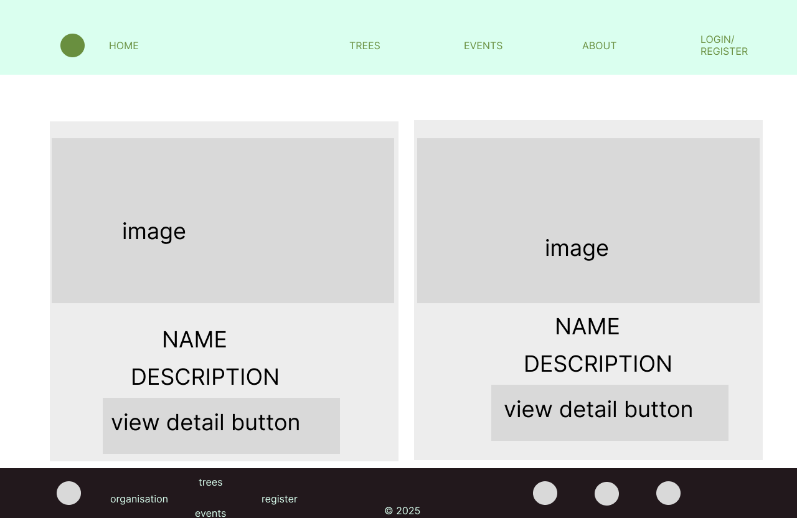
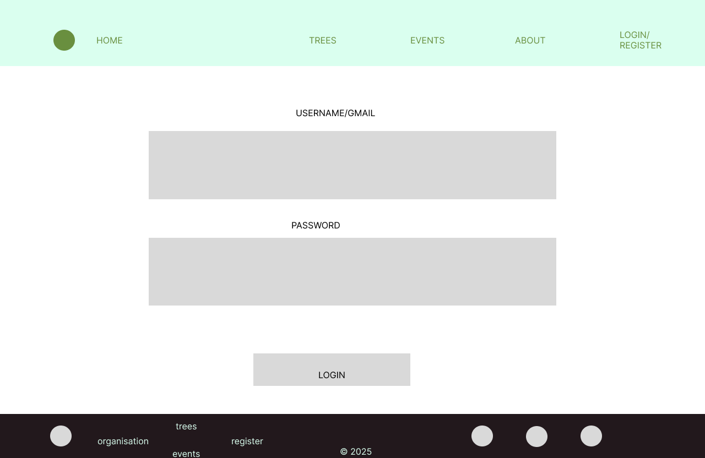
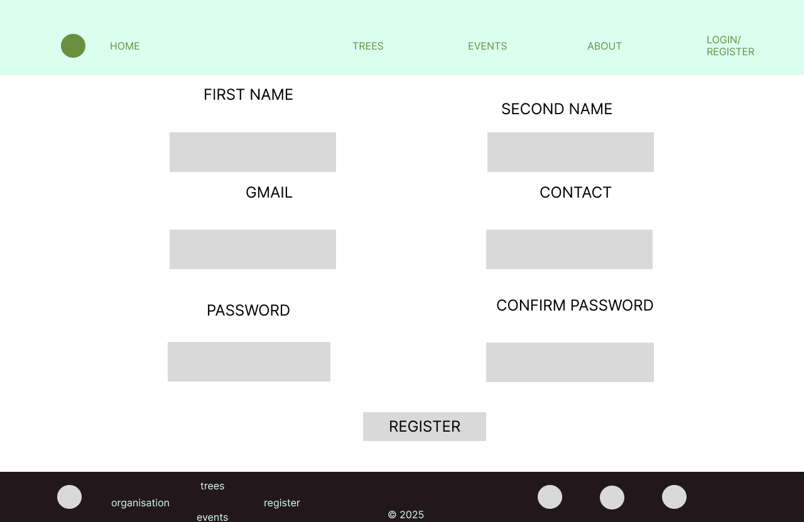

# TREE-PLANTING-AND-TRACKING-APP

*A Django web application for managing tree planting, tracking, events, donations, and environmental sustainability programs.*
The helps to keep track of trees planted and connects sellers to tree growers. It also enable charity incase one wants to donate so as to aid in pushing tree planting .  Apart from  we can have a competition pull on those who have planted the most trees.

[](YOUR_RENDER_URL_HERE)

#  Overview

The **Tree Planting & Tracking App** is a web platform designed to promote environmental conservation by enabling users to:

* Register and add trees
* Track planted trees under my trees
* know more about trees
* Encourage sponsors participation in donating
* Join environmental events
* Manage trees
* Make payments or donations (M-Pesa support)
* Admins can approve trees and manage all operations

This system helps both communities and organizations monitor their environmental impact and enhance participation in sustainability programs.
---


###  User Features

* User registration and login
* Profile management
* Add new trees
* View tree details
* Track  planted trees
* Join environmental events
* Donate or sponsor trees
* Secure payments (M-Pesa Daraja integration)

###  Tree Management

* Add new tree
* Edit user-added trees
* Delete own trees
* Tree location and descriptions
* Tree price and payment method
* Tree leaderboard (top planters/sponsors)

###  Event Management

* Create new environmental events
* Join/attend events
* Admin can approve, edit, or delete events
* Event display on the homepage

###  Admin Features

* Manage all users
* Manage events
* Manage tree sellers/planters
* Add/update event details
* Update payment options
* View dashboards

###  Payments (M-Pesa Daraja API)

* Lipa na M-Pesa STK Push
* Payment validation & confirmation
* Store transaction details
* Reflect sponsor/planter name after payment

---

    MIDDLE LEVEL VISUALISATION OF THE PROJECT

## home page visualisation low level


## tree page visualisation low level



## tree detail page visualisation low level


## events and sponsor page page visualisation low level


## login page visualisation low level



## registration page visualisation low level



## Installation

1. Clone the repo:
```bash
git clone https://github.com/Issa-Josiah/Tree-planting-And-Tracking.git
pip install -r requirements.txt
python manage.py migrate
python manage.py runserver

---

### 6️⃣ Live Deployment

- Add a **direct link to your Render deployment** so visitors can see it live:

```markdown
## Live Demo

Check out the live app hosted on Render: [Tree Planting & Tracking](YOUR_RENDER_URL_HERE)

##  Project Structure

```
Tree_Planting_and_Tracking/
│
├── tree_app/                # Main app: trees, 
├── event/                   # Event management
├── USERS/                # User registration & login, USERS PRESENT AND FUNCTION
├──SPONSORS/
├── static/                  # CSS, JS, images
├── templates/               # HTML Templates
├──MEDIA                       TO UPLOAD VIDEO AND IMAGES
│
├── TREE-PLANTING-AND-TRACKING-APP-main/
│   ├── screenshots/         # User interface images
│   └── information background and architecture/
│
├── manage.py
└── README.md
```

---

## build up step process
- install environment
- install django-admin
- start the django-admin project
- create the user app
- integrate the login,logout, register and mpesa integration

## steps
- install environment to separate from other work
  
        ''''
        python -m venv env
        activate
        source env/Script/activate
        ''''

- this activates you environment
- install django-admin and test


      ''''
    pip install django
    testing
    django-admin
       '''' 

- Next we start the project

        ''''

        django-admin startproject Tree_Tracking_App
        ''''
- enter the directory and start the app
        
        ''''
        python manage.py startapp users

        ''''
  - create the applications

###  Install dependencies

    ''''
    pip install -r requirements.txt
    ''''

###  Apply migrations

    ''''
    python manage.py makemigrations
    python manage.py migrate
    ''''

###  Create a superuser

```
python manage.py createsuperuser
```

###  Run the server

```
python manage.py runserver
```

App will be available at:
 **[http://127.0.0.1:8000/](http://127.0.0.1:8000/)**

---

##  M-Pesa Daraja Setup

1. Create a Safaricom Developer Account
2. Generate **Consumer Key** and **Consumer Secret**
3. Get **Shortcode**, **Passkey**, and Callback URLs
4. Add the credentials to your Django settings:

        ''''
        MPESA_CONSUMER_KEY = "<your_consumer_key>"
        MPESA_CONSUMER_SECRET = "<your_consumer_secret>"
        MPESA_SHORTCODE = "<your_shortcode>"
        MPESA_PASSKEY = "<your_passkey>"
        MPESA_CALLBACK_URL = "https://your-domain.com/mpesa/callback/"
        ''''
##  Screenshots

Add screenshots to help GitHub visitors visualize the app:

* Login Page
  

* Home/dashboard Page
  

* Tree Details
  

* Events Page
  

* Admin Dashboard


---

## 📦 Technologies Used

### Backend

* Python 3.4x
* Django 5.x
* Django ORM
* SQLite / PostgreSQL

### Frontend

* HTML5 / CSS3
* Bootstrap 5
* JavaScript

### Other Tools

* M-Pesa Daraja API
* Git & GitHub
* Pillow (image handling)

---

## 🛡️ Security Features

* CSRF protection
* User authentication
* Admin-only approvals
* Secure payment endpoints
* Input validation


##  Acknowledgements

Special thanks to everyone supporting environmental sustainability, and organizations that empower communities to plant and protect forests.


